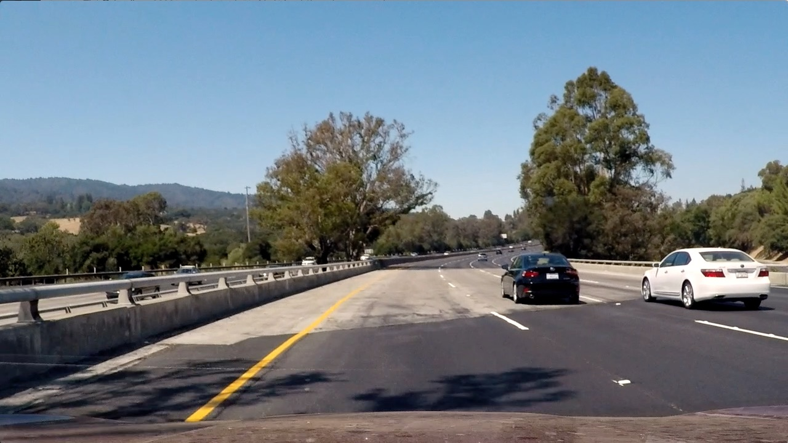
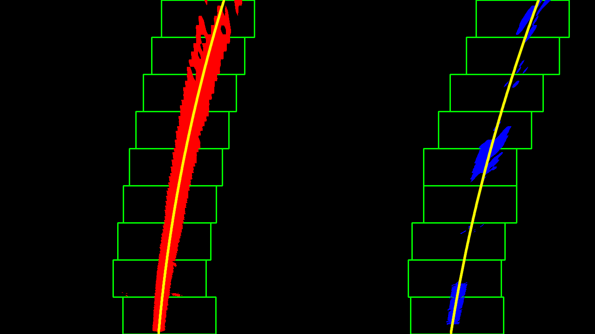

# Self-Driving Car Engineer Nanodegree Program
## Advanced Lane Finding Project

The goals / steps of this project are the following:

* Compute the camera calibration matrix and distortion coefficients given a set of chessboard images.
* Apply a distortion correction to raw images.
* Use color transforms, gradients, etc., to create a thresholded binary image.
* Apply a perspective transform to rectify binary image ("birds-eye view").
* Detect lane pixels and fit to find the lane boundary.
* Determine the curvature of the lane and vehicle position with respect to center.
* Warp the detected lane boundaries back onto the original image.
* Output visual display of the lane boundaries and numerical estimation of lane curvature and vehicle position.

[//]: # (Image References)

[video1]: ./project_video_lanesFound.mp4 "Video"

### Camera Calibration

#### 1. Briefly state how you computed the camera matrix and distortion coefficients. Provide an example of a distortion corrected calibration image.

The code for this step is contained in the function  `def calibrateCamera()` located in the file `helpers.py` (lines 25-70)

This function provides the camera matrix and distortion correction coefficients to help undistort images from the camera. Distortion is inherent with most cameras due to light bending at the edge of a camera lens or the image sensor being non-parallel with the lens. This can be corrected for through processing a series of calibration images, which are pictures of a chessboard taken at different angles.  

The process can be summarized as follows:
1. generate an array of 3d point indices (object points corresponding to the chessboard corners) in real world space [(0,0,0), (1,0,0)...(8,5,0)]  
2. convert calibration images to grayscale and locate the 2d pixel corner locations using the OpenCV function `cv2.findChessboardCorners`
3. feed both object and image points into the OpenCV function "calibrateCamera" to produce the camera matrix and distortion coefficients.

See sample calibration image original (left) and undistorted (right) below:  


### Pipeline (single images)

#### 1. Provide an example of a distortion-corrected image.

See sample original (left) and distortion corrected image (right) below:  



Although the two images appear similar, the effects of distortion correction is more apparent at the edges of images, especially if you look at the white vehicle to the right.


#### 2. Describe how (and identify where in your code) you used color transforms, gradients or other methods to create a thresholded binary image.  Provide an example of a binary image result.

See function `def colorGradientPipeLine(img)` in `helpers.py` (lines 72-108)

The next step is to take the undistorted image and apply a sequence of steps to produce a binary image as follows:
1. Convert from RGB to HLS color space
2. Perform x and y sobel gradient threshold on s-channel
3. Perform sobel magnitude and direction threshold on raw image
4. Perform s-channel and h-channel color thresholding
5. Apply set of logical operators on binary images as follows:  
`combined[(((sobelX == 1) & (sobelY == 1)) | ((sobelMag == 1) & (
      sobelDir == 1))) | ((sChan_binary == 1) & (hChan_binary == 1))] = 1`  

See sample undistorted original images (left) and thresholded binary images (right) below:  

  
<br>

  

#### 3. Describe how (and identify where in your code) you performed a perspective transform and provide an example of a transformed image.

See function `def warpPerspective(image)` in `helpers.py` (lines 167-187)

In order to accurately measure the lane curvature, a perspective transform must be performed to convert the front facing road image to a top-down view. This is done by using the OpenCV function `cv2.getPerspectiveTransform(src, dst)` which takes in an array of source (`src`) and destination (`pts`) and returns the transformation matrix (`M`). The function `cv2.warpPerspective` takes `M` as an input and applies it to the binary thresholded image to return the warped image as seen below.  

See sample original binary thresholded images (left) and perspective transformed images (right) below:  

  
<br>


*Note: The src points are selected by manually locating points along the parallel lane lines in the front facing image and verifying them by drawing it back onto the original and transformed image as seen below.*

```python
src = np.float32(
    [[(img_size[0] / 2) - 55, img_size[1] / 2 + 100],
    [((img_size[0] / 6) - 10), img_size[1]],
    [(img_size[0] * 5 / 6) + 60, img_size[1]],
    [(img_size[0] / 2 + 55), img_size[1] / 2 + 100]])
dst = np.float32(
    [[(img_size[0] / 4), 0],
    [(img_size[0] / 4), img_size[1]],
    [(img_size[0] * 3 / 4), img_size[1]],
    [(img_size[0] * 3 / 4), 0]])
  ```
See sample original image with `src` points (left) and `dst` points in perspective transformed image (right):  
  
    

I verified that my perspective transform was working as expected by drawing the `src` and `dst` points onto a test image and its warped counterpart to verify that the lines appear parallel in the warped image.  

#### 4. Describe how (and identify where in your code) you identified lane-line pixels and fit their positions with a polynomial?

The lane-line pixels are identified by the functions `def find_lane_pixels` (lines 189-274) and `def searchExistingLanes` (lines 275-344) in `helpers.py`.

The first function (find_lane_pixels) is called if either lane lane was not detected in the previous frame or it is the first frame. It starts by taking a histogram of the bottom half of the image (sum of values in columns) and setting the left and right lane line bases to the max column index.

A series of stacked rectangles (or windows) are generated from the image base and each of the windows are iterated through and scanned for nonzero pixels. If the number of nonzero pixels exceeds the threshold `mixpix = 50` per window, the window is recentered according to the mean.  



If the lane was detected in the prior frame, The second function (searchExistingLanes) is called. Rather than start the search from scratch, this function looks for nonzero pixels within a +/- margin around the previous polynomial fit line which can save computing time/energy.   


The function determines a line is detected if the number for pixels found per lane exceeds the threshold defined in the variable `minPixDetect` (line 362 in helpers.py)

The captured x and y pixels are then fitted to 2nd order polynomial curve using the function `def fit_poly` and the fitted x-values are appended to the respective lane's class variable `recent_xfitted`, which keeps a running count of the previous n=10 frames.

To determine the "best fit" line, an exponential moving average (EMA) filter is applied to the previous 10 frames using the function `def EMAcalc`. This filter gives highest weight to new frames and exponentially decreasing weight to older frames. See figure below:  
*Reference: https://en.wikipedia.org/wiki/Moving_average#Exponential_moving_average*  


#### 5. Describe how (and identify where in your code) you calculated the radius of curvature of the lane and the position of the vehicle with respect to center.

The radius of curvature is calculated in the function `def measure_curvature_real` which computes the radius using the fitted polynomial coefficients (of the best fit line) according to the below equation and averaging them between the left and right line.

```python
curverad = (1+(2*fit_cr[0]*y_eval+fit_cr[1])**2)**(3/2)/abs(2*fit_cr[0])
  ```  

The vehicle offset from the center of the road is calculated by finding the difference between the left and right lane base positions according to the below equation:

```python
offset = (rightLine.line_base_pos - leftLine.line_base_pos)/2*xm_per_pix
```

Both the radius and offset text information are added to the final image in the function `def addTextResult`.

#### 6. Provide an example image of your result plotted back down onto the road such that the lane area is identified clearly.  

The lane area visualization and inverse warp perspective can be found towards the end of the function `def fit_polynomial` (lines 437 - 455). A polygon is formed with the left and right lane boundaries and filled green using the `fillPoly` function in OpenCV. The image is then warped back using `Minv`, the inverse perspective matrix and added back onto the original undistorted road image. The end result can be seen below:  


---

### Pipeline (video)

#### 1. Provide a link to your final video output.  Your pipeline should perform reasonably well on the entire project video (wobbly lines are ok but no catastrophic failures that would cause the car to drive off the road!).

Here's a [link to my video result](./project_video_lanesfound.mp4)

---

### Discussion

#### 1. Briefly discuss any problems / issues you faced in your implementation of this project.  Where will your pipeline likely fail?  What could you do to make it more robust?

While the standard project video worked well with this implementation, the `challenge_video.mp4` had a few issues:

*   Detection of unintentional lines: Stray lines, shadows, edges between the road and side barrier were picked up as lines which skewed the poly fit line. More work  will be needed to better isolate the yellow and white channel.  

*   Determination of detected lines: Since the current algorithm does not update "recent_xfitted" if insufficient pixels were found, the fitted polynomial line is "stuck" for most of the video. This issue should be resolved however if we introduce additional features for detection of lane lines as follows:

*   There could be additional features to reject lines that do not meet certain criteria beyond pixel count, for example: region based detection (reject lines that are not within the distance threshold of each other), filtering lines that are not within a certain margin of parallelism, rejecting points that exceed deviation thresholds from previous points, dynamic parameters that change based on location of image or number of pixels found.

*  Extreme curves: Current pipeline would not do well with extreme turns. One option here is to detect large curves ahead of time by measuring the curvature up ahead (instead of at the base) and using that information to search for lanes up ahead.
